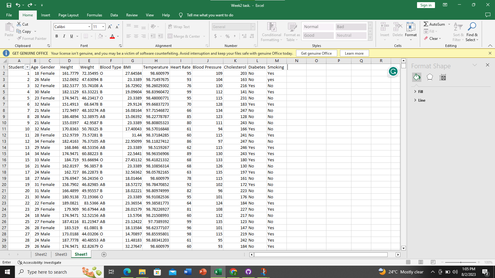
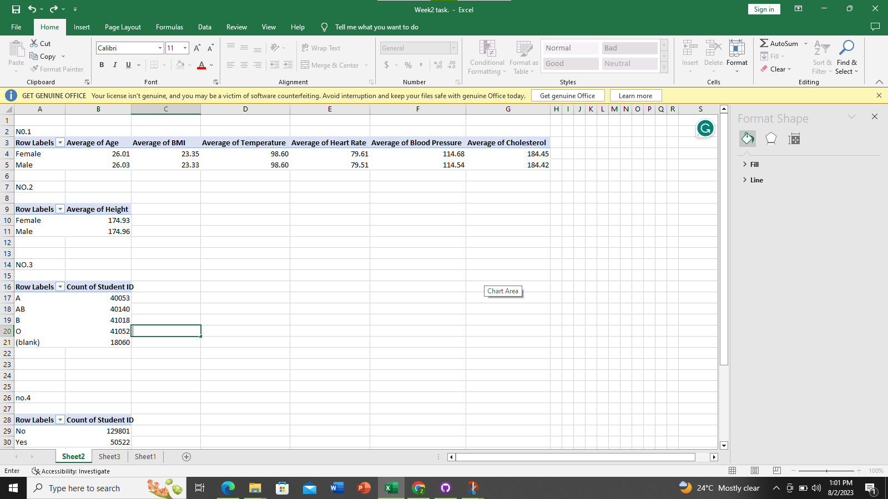
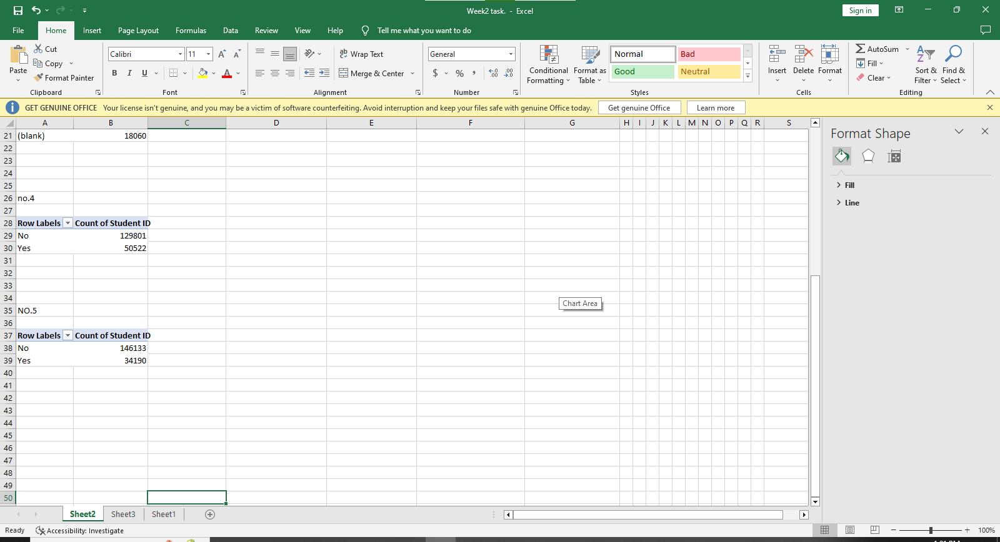
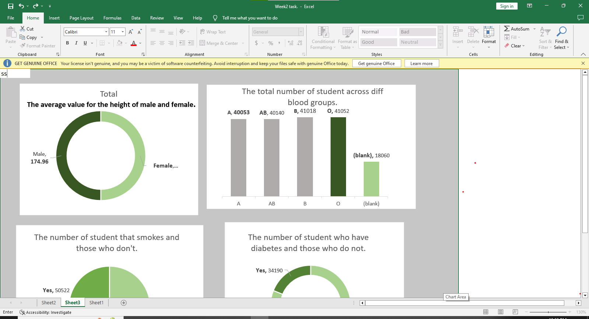
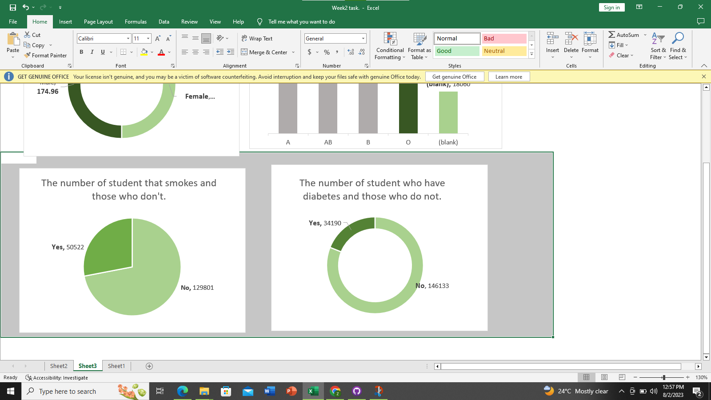

# ANALYSIS-ON-MEDICAL-STUDENT-DATA
**#Introduction**

This is a task given to practice the use of pivot tables and visualization for data analysis using the excel tool. A data of some medical students was provided for the purpose of the class and the assignment by the instructor, Promise Chinonso.

**#Task**
Using the Medical Students Data, create Pivot Tables displaying the following:
	Average values for the following for Males and Females (Age, BMI, Temperature, Heart Rate, Blood Pressure, and Cholesterol)
 Average Height and Weight for both Genders (in 2 decimal places)
	
 Number of students across the different Blood Groups
	
 Number of Students who smoke and those who don’t
	
 Number of Students who have diabetes and those who don’t

**#Skills demonstrated**

-Data cleaning
The raw data provided had blanks in it. Making it unsuitable to be used for the purpose of the analysis. The first step was to clean the data by filling in the missing values(blanks).
A screenshot of the cleaned data can be found below.

**#Creating pivot tables

Now that I can proceed with my analysis, I started with creating my pivot table, finding solutions to the questions above.
The first step was to open a new sheet titled “pivot tables”.
The table was created using the “insert icon” and selecting “pivot tables”. 
Then, the pivot table appears at the spot with another table to guide where my variables/column names will be inserted.
Repeated a similar process for all the five questions provided.
Below are the pivot tables created.

**#Data visualization of the pivot table.

This passes the same information as the pivot table with graphics/visuals being the difference. i.e. creating a graphics representation of the tables created above. This is easier for a layman to decode because of its detail and how appealing and interesting it appears.
Below is the graphical representation of the provided task above.

**#Conclusion

The task stretched me and tested my understanding of pivot tables and visualization using excel for data analysis and solving real life problems. I look forward to how much better I can get.)

